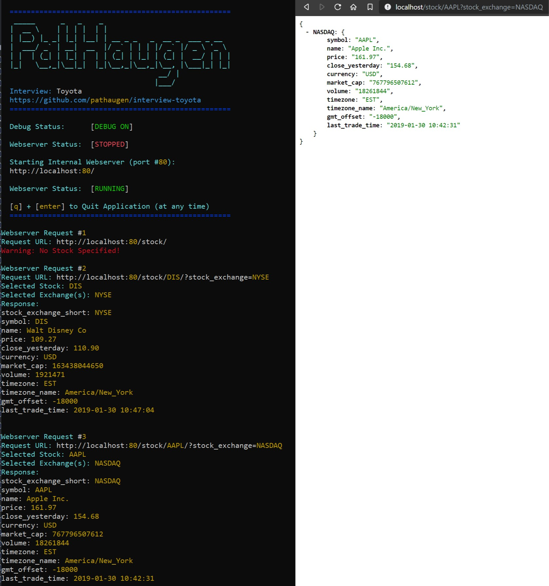

interview-toyota
================

interview-toyota: toyota interview question expanded to a public repo.

NOTE: apitoken.go contains the "apiToken" variable which MUST be set utilizing your api_token from worldtradingdata.com in order for application to function!

Building Application (Windows)
------------------------------

1. Install Go:
   * https://golang.org/dl/
   * Recommend C:\Go on Windows
   * Test Go Installation:
     * > go version
2. Setup Go:
   * Create File Structure:
     * C:\go-work\bin
     * C:\go-work\pkg
     * C:\go-work\src
   * Check Environment Variables:
     * GOROOT: C:\Go
     * GOPATH: C:\go-work
3. Setup Git:
   * Install Git:
     * https://git-scm.com/
   * Test Git Installation:
     * > git --version
4. Build and Run Application:
   * Open Command Prompt
   * > mkdir c:\git
   * > cd c:\git
   * > git clone https://github.com/pathaugen/interview-toyota.git
   * > cd c:\git\interview-toyota
   * Open c:\git\interview-toyota\apitoken.go and update the apiToken with your api_key from worldtradingdata.com
   * > go build
   * interview-toyota.exe

Related Links
-------------
* https://github.com/pathaugen/
* https://circleci.com/gh/pathaugen/
* https://travis-ci.com/pathaugen/
* https://www.linkedin.com/in/patrickhaugen/
